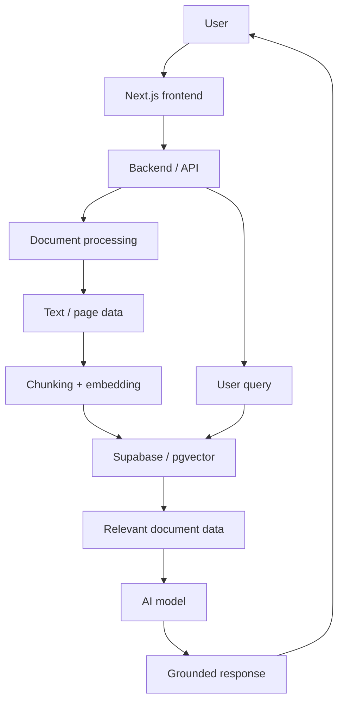
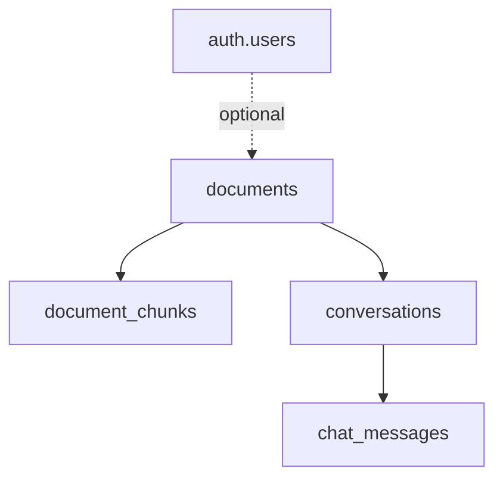
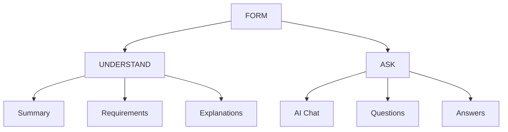

# FormFriend

> **Make forms make sense.**

FormFriend is a minimal, AI-powered document assistant that helps people understand complicated forms, applications, and institutional documents before filling them out.

**Core flow:** Upload a form -> understand it -> know what you need -> ask questions.

This project is being developed for the GOMYCODE **COME. BUILD. WITH AI.** hackathon on September 27, 2026. It intentionally does not attempt to become “EaziWage 2.0”.

## Contents

- [Product Concept](#product-concept)
- [Problem](#problem)
- [Target Users](#target-users)
- [Expected Impact](#expected-impact)
- [Core User Experience](#core-user-experience)
- [Main Features](#main-features)
- [Planned Demo](#planned-demo)
- [Data Sources and Permissions](#data-sources-and-permissions)
- [AI Architecture](#ai-architecture)
- [GPU / NVIDIA Brev Plan](#gpu--nvidia-brev-plan)
- [Fallback Plan](#brev-fallback-plan)
- [Technology Stack](#technology-stack)
- [Authentication](#authentication)
- [UI and Visual Direction](#ui-and-visual-direction)
- [Product Experience](#product-experience)
- [MVP Scope](#mvp-scope)
- [Data Model](#data-model)
- [Hackathon Strategy](#hackathon-strategy)
- [Final Product Definition](#final-product-definition)

## Product Concept

Many forms assume users already understand the terminology, process, eligibility requirements, and supporting documents involved.

FormFriend acts as an AI guide alongside the form. A user should be able to upload a document and quickly get:

- A plain-language explanation of what the form is
- Explanations of confusing fields or sections
- Required information and supporting-document checklists
- Answers to questions about the document
- Relevant source references from the original document

The form is the main component. Everything else exists to help the user understand and use it.

## Problem

Users often struggle with:

- Technical or bureaucratic terminology
- Understanding what individual fields are asking for
- Knowing which supporting documents are required
- Understanding eligibility requirements
- Navigating long PDF documents
- Scanned or visually complex forms
- Knowing what information to prepare before starting

The problem is not necessarily access to the form. The problem is understanding the form.

## Target Users

Initial target users include:

- Students
- Job seekers
- First-time applicants
- Small-business owners
- People applying for public or institutional services
- Anyone unfamiliar with bureaucratic or technical forms

## Expected Impact

FormFriend aims to reduce the cognitive barrier between:

> “I need this service.”

and:

> “I understand what I need to do.”

The product should make unfamiliar forms less intimidating and help users prepare before beginning an application.

## Core User Experience

The core experience requires no login. A new user should be able to:

1. Open FormFriend.
2. Upload a form.
3. Wait while the document is processed.
4. Receive an overview and requirements.
5. Ask questions about the document.
6. Get grounded answers.

No registration wall should appear before the user experiences the core value.

## Main Features

### Document Upload

Initial formats:

- PDF
- PNG
- JPG

**Primary CTA:** `Upload a form`

The upload experience should support drag-and-drop and normal file selection.

### Document Overview

The overview should explain:

- What the document is
- Who it is intended for
- What the user needs before starting
- Important requirements

### Field and Section Explanation

Users can ask about a confusing field, for example:

> “What does ‘Nature of Business’ mean?”

FormFriend explains it in plain language using the source document where possible.

### Preparation Checklist

FormFriend identifies information and supporting documents the user may need.

**Before you begin:**

- [x] National identification document
- [x] Contact information
- [x] Business information
- [ ] Supporting documentation

### Ask the Document

Example questions:

- “What documents do I need?”
- “What is this form for?”
- “Who is eligible?”
- “What does section 4 mean?”
- “Where do I submit this?”

Responses should be grounded in the source document whenever possible. If the document does not contain enough information, the AI should say so rather than inventing an answer.

## Planned Demo

The demo should center on one clear user journey:

1. Open FormFriend with no login.
2. Upload a complicated public form.
3. Show concise processing states.
4. Display the document overview and checklist.
5. Ask: “What documents do I need before I start?”
6. Explain a confusing field.
7. Optionally show the save/login prompt after the user has experienced the core value.

Example processing states:

- Reading document
- Understanding sections
- Finding requirements
- Preparing your assistant

Do not fake detailed progress if the underlying system is not actually performing those stages.

## Data Sources and Permissions

The prototype will use publicly available documents, such as:

- Public government forms
- Institutional application forms
- Public service documents
- Public instructions
- Public eligibility guides

**Initial target:** 20-50 documents and 100-200 pages.

The demo dataset should use blank/public documents rather than completed forms containing personal information. Only publicly accessible documents should be used, and no private user documents or personally identifiable information should be included in the demonstration dataset.

## AI Architecture

The core AI pattern is retrieval-augmented generation (RAG):



## GPU / NVIDIA Brev Plan

NVIDIA Brev credits are not guaranteed. Brev is a preferred compute path, not a product dependency.

### Preferred Workload

- **Task:** Inference
- **Model:** 7B-8B class vision-language model
- **Purpose:** Multimodal document understanding

The model should be capable of processing visually complex or scanned documents and identifying:

- Text
- Form fields
- Tables
- Checkboxes
- Sections
- Visual relationships between labels and input areas
- Document structure

The exact model/version will be selected based on what is available and compatible with the allocated Brev GPU. No fine-tuning is planned.

### Dataset and Runs

- 20-50 documents
- 100-200 pages
- Roughly 50-200 document-page inference calls during development and the final demonstration

### Estimated Resources

| Resource | Estimate |
| --- | --- |
| GPU | 1 NVIDIA GPU |
| VRAM | 16-24 GB |
| Compute | 4-6 GPU hours |
| Storage | 10-20 GB |

The estimate covers model loading, preprocessing, page/image processing, repeated development inference, prompt experimentation, final demo runs, model weights, dependencies, cached documents, extracted images, and intermediate outputs.

### Technical Readiness

The technical owner is the project developer. The frontend architecture, product flow, UI specification, data model, technology stack, fallback path, and MVP boundary are defined before implementation.

Execution plan:

1. Build the UI first.
2. Establish the document-processing flow.
3. Connect Supabase.
4. Integrate the AI pipeline.
5. Use Brev if approved.
6. Use the reduced-scope API path if Brev is not approved.
7. Complete and rehearse the end-to-end demo.

## Why GPU / Why APIs May Be Insufficient

The GPU case is specifically about visual document understanding. Standard text extraction can lose:

- Form layout
- Field boundaries
- Tables
- Checkboxes
- Visual grouping
- Relationships between labels and input areas
- Information contained in scanned pages

A hosted multimodal API could perform much of this work, but local VLM inference on Brev would allow the project to demonstrate an actual GPU-accelerated workload and experiment with document understanding without making the product dependent on an external inference provider.

The GPU is an enhancement to the document-processing pipeline, not the definition of the product.

## Brev Fallback Plan

If the Brev request is not approved, FormFriend will use a reduced-scope implementation.

### Fallback Stack

- Next.js / TypeScript
- Supabase PostgreSQL
- Standard PDF/text extraction
- Hosted multimodal or language model API
- Retrieval-based document question answering

### Fallback Scope

- Approximately 5-10 public documents
- Priority on machine-readable PDFs and simpler layouts
- Document ingestion
- Retrieval
- Plain-language explanations
- Preparation checklists
- Question answering

The local vision-model component will be removed. The core product remains functional without GPU access.

## Technology Stack

| Area | Technologies |
| --- | --- |
| Frontend | Next.js, TypeScript, Tailwind CSS |
| UI | shadcn/ui, custom React components |
| Animation | GSAP, used selectively; React Bits may be used for one or two restrained components |
| Backend | Next.js API routes / server actions; Python where useful for document processing or model inference |
| Database | Supabase, PostgreSQL, pgvector |
| AI | Local VLM through NVIDIA Brev if approved; hosted multimodal/language model API as fallback |
| Deployment | Vercel; NVIDIA Brev if approved |

Animation should support comprehension rather than become the product.

## Authentication

Authentication is optional. The core product should work without login.

### Anonymous / Free

Users should be able to:

- Upload documents
- Ask questions
- Explain fields
- Generate preparation checklists

### Optional Account Features

Authentication can unlock:

- Saved documents
- Document history
- Saved explanations
- Personalized document libraries
- Cross-device access
- Higher usage limits
- Additional AI features

### Providers

Google is the primary social-login option. LinkedIn is a potential option, especially for professional and employment-related documents.

Spotify was discussed as a deliberately wild/experimental OAuth idea. It is not a priority and should not be implemented during the hackathon unless the core product is already complete and there is a legitimate product reason to support it.

## UI and Visual Direction

### UI Philosophy

The UI should be:

- Minimalistic
- Direct
- Document-first
- Calm
- Responsive
- AI-aware without looking like an “AI dashboard”

The design takes inspiration from the interaction simplicity of Lovable, without copying its design.

> Don’t build pages around the product. Build the interface around the user’s task.

FormFriend should not feel like a marketing website with a tool hidden inside it. The product itself should be the interface.

### Visual Identity

#### Colors

| Role | Color |
| --- | --- |
| Background | `#F8F8F6` |
| Surface | `#FFFFFF` |
| Primary text | `#171717` |
| Secondary text | `#6B6B6B` |
| Muted text | `#999999` |
| Border | `#E7E7E3` |
| Primary accent | `#6D5EF5` |
| Accent soft | `#F0EEFF` |
| Success | `#16A34A` |
| Warning | `#D97706` |
| Error | `#DC2626` |

Use a light-first palette with a restrained violet accent. Avoid the generic neon-blue “AI product” aesthetic.

#### Typography

- **Primary font:** Geist
- **Fallback:** Geist, Inter, system-ui, sans-serif

| Element | Desktop | Mobile | Weight |
| --- | --- | --- | --- |
| Hero | 48-64px | 36-42px | 600 |
| Page heading | 32px | 28px | 600 |
| Section heading | 20-24px | 20px | 600 |
| Body | 15-16px | 15-16px | 400 |
| Small text | 13-14px | 13-14px | 400 |
| Labels | 12-13px | 12-13px | 500 |
| Buttons | 14px | 14px | 500 |

Avoid enormous marketing-style headings.

## Product Experience

### Product Messaging

- **Primary:** Make forms make sense.
- **Supporting:** Upload a form. Understand what it means. Know what you need before you start.
- **Primary CTA:** Upload a form

Inside the application:

- Here’s what we found.
- What is this form?
- What do I need?
- Anything confusing?

Avoid corporate phrases such as “AI-powered document intelligence platform”. The product should sound like a useful tool, not a corporate press release.

### Initial Landing UI

The first screen should be extremely minimal:

```text
FormFriend

Make forms make sense.

Upload a form. We'll explain the rest.

[ Upload form ]

PDF · JPG · PNG
No account required

Explain fields · Find requirements · Ask questions
```

No testimonials, stats, fake user counts, pricing, or unnecessary marketing sections.

### UI States

The application is modeled as states, not a collection of marketing pages.

```text
State A - Landing / Upload
AppShell
|- Header
|- Hero
|  |- Heading
|  |- Description
|  `- UploadZone
|- CapabilityHints
`- MinimalFooter

State B - Processing
DocumentProcessing
|- FilePreview
|- ProcessingIndicator
|- ProcessingSteps
`- Cancel

State C - Workspace
Workspace
|- Header
|- DocumentPanel
|  |- DocumentPreview
|  `- PageControls
`- AssistantPanel
   |- DocumentSummary
   |- RequirementList
   |- SuggestedQuestions
   |- ChatMessages
   `- ChatInput
```

### Components

#### shadcn/ui

Use prebuilt components where appropriate:

- Button
- Input
- Textarea
- Card
- Dialog
- Sheet
- Dropdown Menu
- Tooltip
- Tabs
- Badge
- Progress
- Skeleton
- ScrollArea
- Separator
- Sonner

#### Custom Components

- Logo
- UploadZone
- DocumentPreview
- DocumentSummary
- RequirementList
- FieldExplanation
- ChatPanel
- ChatMessage
- SourceCitation
- ProcessingState
- EmptyState
- AuthPrompt

### Suggested Questions

After processing, show suggested questions so users do not need to invent prompts:

- What is this form for?
- What documents do I need?
- Who can fill this out?
- Explain section 4

Clicking a suggestion should immediately send it to the assistant.

### Responsiveness

Design desktop, tablet, and mobile together.

- **Desktop:** Use a two-column workspace with the document and AI assistant side by side.
- **Tablet:** Keep the document/assistant relationship while allowing the assistant to become a side panel or stacked section.
- **Mobile:** Stack the document preview, summary, checklist, and chat vertically. Keep the chat input easy to reach.

### Animation Direction

Animation should support comprehension, not compete with it.

Preferred GSAP use cases:

- Page entrance
- Upload interaction
- Upload -> processing transition
- Processing -> workspace transition
- Result reveal

Preferred transition:

```text
UPLOAD
  |
document expands
  |
analysis appears
  |
workspace settles
```

Target transition duration: 600-800ms.

AI messages can use a subtle fade/translate transition. Avoid animating every word individually.

## Things We Explicitly Do Not Build

Hackathon scope exclusions:

- Pricing page
- Testimonials
- Fake statistics
- About page
- Blog
- Dashboard
- Notification center
- Settings page
- Complex navigation
- Admin panel
- Excessive animations
- Dark/light theme switcher
- Subscription system
- Social feed
- AI-agent architecture
- Unnecessary 3D effects
- Spotify authentication

The hackathon does not need a complete SaaS company in one day.

## Data Model

Four core application tables are sufficient for the MVP:



### `documents`

```sql
id
user_id nullable
session_id nullable
title
file_path
file_type
file_size
status
page_count
summary nullable
created_at
updated_at
```

### `document_chunks`

```sql
id
document_id
content
page_number
chunk_index
embedding
metadata
created_at
```

### `conversations`

```sql
id
document_id
user_id nullable
session_id nullable
title nullable
created_at
```

### `chat_messages`

```sql
id
conversation_id
role
content
sources
created_at
```

Example conversation:

```text
conversation
|- user: "What documents do I need?"
|- assistant: "You need..."
|- user: "What does section 4 mean?"
`- assistant: "Section 4 is asking..."
```

### Optional Future Table: `usage_events`

This is not required for the MVP.

Potential fields:

```sql
id
user_id
session_id
event_type
document_id
created_at
metadata
```

Potential events:

- `document_uploaded`
- `document_processed`
- `question_asked`
- `document_saved`
- `login_completed`

### Anonymous -> Authenticated Model

**Anonymous:**

```text
user_id = NULL
session_id = active session
```

**Authenticated:**

```text
user_id = auth.users.id
```

The user should experience the product first and authenticate only when they want persistence or additional features.

### What We Are Not Modeling Yet

Do not prematurely create:

- `forms`
- `form_fields`
- `form_sections`
- `form_requirements`

At MVP stage, a form is treated as a document. If structured field extraction becomes a real requirement later, dedicated tables can be introduced.

## Product Principle

> Don’t make people create an account before they understand why they need one.

The AI should remove complexity from the document. The product itself should not introduce another layer of complexity.

## Hackathon Strategy

Optimize for a convincing working core rather than feature volume.

The most important sequence is:

```text
Upload -> Understand -> Retrieve -> Explain -> Ask -> Answer
```

The frontend is intentionally being built first so the product experience is established before backend integration. The backend is then wired underneath the existing interface.

> We cannot have a backend without a frontend. 😂

The UI-first approach also prevents spending too much hackathon time building infrastructure for an interface that has not yet been validated.

## MVP Scope

The hackathon MVP prioritizes:

- Document upload
- Document understanding
- Semantic retrieval
- AI explanation
- Preparation checklist
- No-login core experience
- Working end-to-end demo

Everything else is secondary. The objective is not to build a complete document platform in one day. The objective is to make one confusing document feel dramatically easier to understand.

## Current Build Order

### Phase 1 - UI

Build the complete visual experience with mock data:

- Landing/upload state
- Processing state
- Document workspace
- Document preview
- Summary
- Requirements
- Suggested questions
- Chat interface
- Responsive behavior
- Authentication prompt

### Phase 2 - Data / Backend

Connect:

- Supabase
- Storage
- PostgreSQL
- pgvector
- Document records
- Chunks
- Conversations
- Messages

### Phase 3 - AI

Implement:

- Document extraction
- Chunking
- Embeddings
- Retrieval
- Grounded question answering
- Document summarization
- Requirement extraction

### Phase 4 - GPU

If Brev is approved:

- Provision GPU
- Deploy compatible VLM
- Test visual document inference
- Integrate it into the document-processing pipeline

If Brev is not approved, use the reduced-scope API path.

### Phase 5 - Demo

- Select the final public document
- Test the end-to-end flow
- Remove unnecessary UI
- Fix visual issues
- Prepare the demo
- Ensure the core interaction works reliably

## Design Philosophy

FormFriend should not look like:

> “A website that has an AI feature.”

It should look like:

> “A tool that happens to be powered by AI.”

The UI should make the user's task obvious within seconds.

The form is the center. The AI is the guide. Everything else gets out of the way.

## Final Product Definition

At its simplest:



**FormFriend = Upload -> Understand -> Complete.**